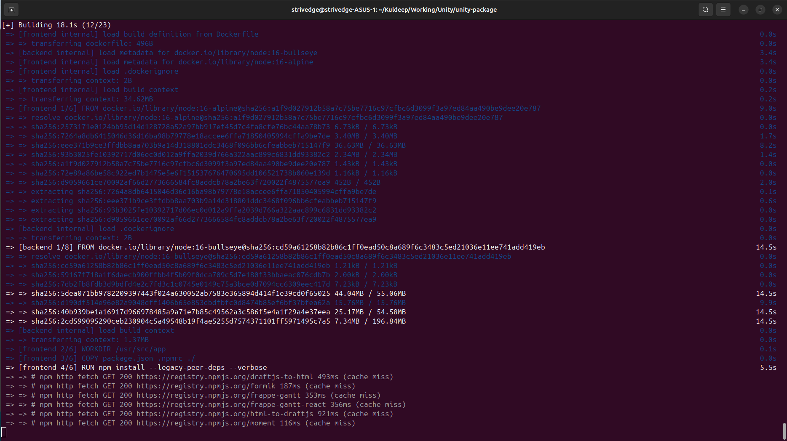
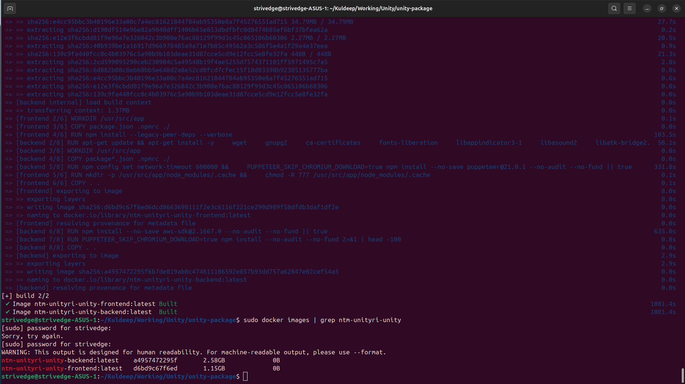
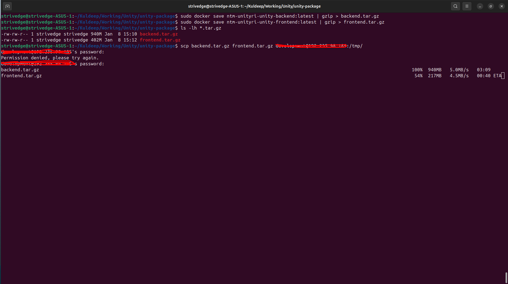
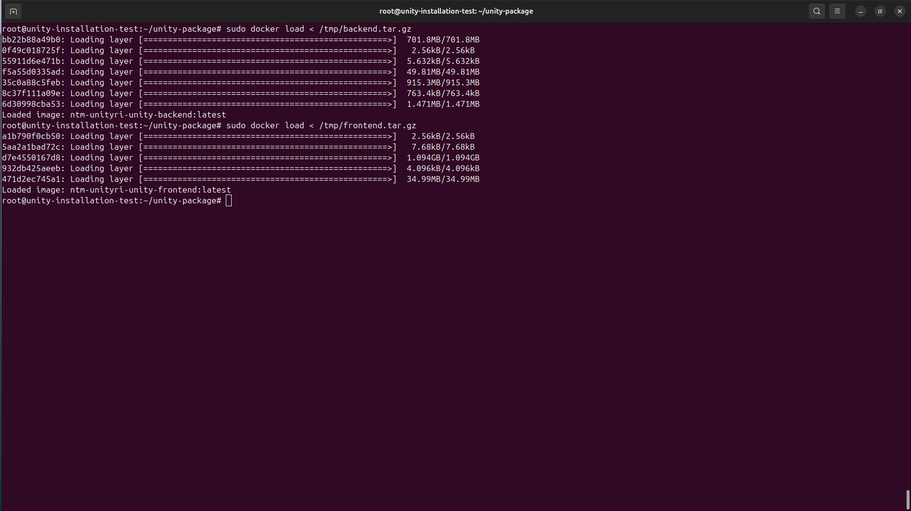
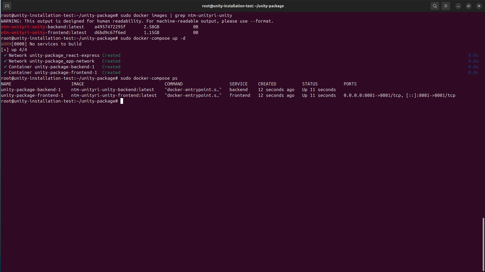
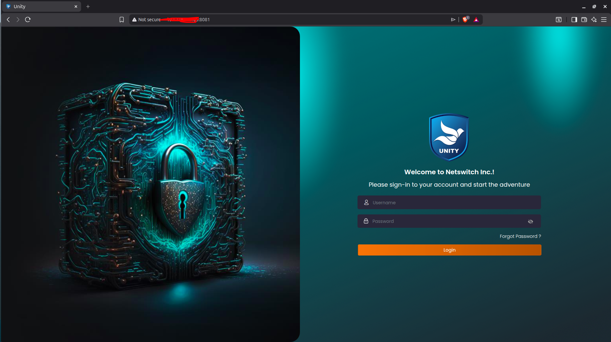

# Local Build & Cloud Deployment Guide

**Deployment Method:** Build Docker images locally, transfer to cloud server
**Status:** ✅ RECOMMENDED - Fast, reliable, best practice
**Estimated Time:** 15-20 minutes

---

## 📋 Table of Contents

1. [Prerequisites](#prerequisites)
2. [Port Requirements](#port-requirements)
3. [Environment Configuration](#environment-configuration)
4. [Database Setup](#database-setup)
5. [Step 1: Build Locally](#step-1-build-locally)
6. [Step 2: Transfer to Cloud Server](#step-2-transfer-to-cloud-server)
7. [Step 3: Deploy on Cloud Server](#step-3-deploy-on-cloud-server)
8. [Step 4: Configure Firewall](#step-4-configure-firewall)
9. [Step 5: Verify Deployment](#step-5-verify-deployment)
10. [Troubleshooting](#troubleshooting)
11. [Rollback Procedure](#rollback-procedure)

---

## Prerequisites

### On Local Machine:
- ✅ Docker & Docker Compose installed
- ✅ Project source code available
- ✅ SSH access to cloud server
- ✅ Sufficient disk space (~5GB free)

### On Cloud Server:
- ✅ Docker & Docker Compose installed
- ✅ SSH access enabled
- ✅ Ports 3006 and 8081 available
- ✅ MongoDB installed and running
- ✅ Git installed (for updates)
- ✅ NGINX installed (optional, for reverse proxy)

### Software Installation Links:

| Software | Installation Guide |
|----------|-------------------|
| **MongoDB** | https://www.mongodb.com/docs/manual/tutorial/install-mongodb-on-ubuntu/ |
| **Docker** | https://docs.docker.com/engine/install/ubuntu/ |
| **Docker Compose** | https://docs.docker.com/compose/install/ |
| **NGINX** | https://nginx.org/en/linux_packages.html#Ubuntu |
| **Git** | `sudo apt install git` |

### Quick Install Commands (Ubuntu):
```bash
# Update system
sudo apt update && sudo apt upgrade -y

# Install Git
sudo apt install -y git

# Install Docker
sudo apt install -y docker.io docker-compose
sudo systemctl enable docker
sudo systemctl start docker

# Install NGINX (optional)
sudo apt install -y nginx
sudo systemctl enable nginx
sudo systemctl start nginx

# For MongoDB, follow the official guide above
```

### Check Prerequisites:
```bash
# Local machine
docker --version          # Should be 20.10+
docker-compose --version  # Should be 1.29+
ssh username@your-server-ip # Should connect

# Cloud server (via SSH)
docker --version
docker-compose --version
mongod --version          # MongoDB installed
nginx -v                  # NGINX installed (optional)
git --version             # Git installed
```

---

## Port Requirements

### Application Ports:
| Service | Port | Protocol | Purpose |
|---------|------|----------|---------|
| **Backend API** | 3006 | TCP | REST API endpoints |
| **Frontend** | 8081 | TCP | Web application |
| **MongoDB** | 27017 | TCP | Database (internal) |

### Firewall Rules Needed:
```
ALLOW 3006/tcp from anywhere
ALLOW 8081/tcp from anywhere
ALLOW 27017/tcp from localhost only (internal)
```

---

## Environment Configuration

### ⚠️ IMPORTANT: Configure .env Files Before Deployment

You must create and configure **three .env files** on your cloud server before deploying.

### 1. Root `.env` File (Project Root)

**Location:** `/path/to/your-project/.env`

```bash
# Create root .env file
nano .env
```

**Contents:**
```bash
# Port Configuration
FRONTEND_PORT=8081
BACKEND_PORT=3006

# MongoDB Configuration
MONGO_DB_HOST=127.0.0.1
MONGO_DB_PORT=27017
MONGO_DB_NAME=unity
MONGO_DB_DUMP_DIR=./dump/database

# Display Settings
REACT_APP_IS_EMPTY_BLANK_DATA_DISPLAY=false
```

### 2. Backend `.env` File

**Location:** `/path/to/your-project/backend/.env`

```bash
# Create backend .env file
nano backend/.env
```

**Contents:**
```bash
# Server Configuration
PORT=3006
HOST=127.0.0.1

# Frontend URL (replace with your server IP)
FRONT_WEB_URL=http://your-server-ip:8081

# Backend URL (replace with your server IP)
BACK_UNITY_URL=http://your-server-ip:3006

# Database Configuration
DATABASE_NAME=unity
DB_PORT=27017
```

**⚠️ Replace `your-server-ip` with your actual server IP address!**

### 3. Frontend `.env` File

**Location:** `/path/to/your-project/frontend/.env`

```bash
# Create frontend .env file
nano frontend/.env
```

**Contents:**
```bash
# Application Port
PORT=8081

# Backend API URL (replace with your server IP)
REACT_APP_BACKEND_REST_API_URL=http://your-server-ip:3006

# Company Information (customize as needed)
REACT_APP_COMPANY_NAME="Your Company Name"
REACT_APP_COMPANY_URL="https://yourcompany.com"

# Display Settings
REACT_APP_IS_EMPTY_BLANK_DATA_DISPLAY=false
```

**⚠️ Replace `your-server-ip` with your actual server IP address!**

### Quick Setup Script

Create all .env files at once:

```bash
# Navigate to project directory
cd /path/to/your-project

# Set your server IP (replace with actual IP)
SERVER_IP="123.45.67.89"

# Create root .env
cat > .env << EOF
FRONTEND_PORT=8081
BACKEND_PORT=3006
MONGO_DB_HOST=127.0.0.1
MONGO_DB_PORT=27017
MONGO_DB_NAME=unity
MONGO_DB_DUMP_DIR=./dump/database
REACT_APP_IS_EMPTY_BLANK_DATA_DISPLAY=false
EOF

# Create backend .env
cat > backend/.env << EOF
PORT=3006
HOST=127.0.0.1
FRONT_WEB_URL=http://${SERVER_IP}:8081
BACK_UNITY_URL=http://${SERVER_IP}:3006
DATABASE_NAME=unity
DB_PORT=27017
EOF

# Create frontend .env
cat > frontend/.env << EOF
PORT=8081
REACT_APP_BACKEND_REST_API_URL=http://${SERVER_IP}:3006
REACT_APP_COMPANY_NAME="Your Company Name"
REACT_APP_COMPANY_URL="https://yourcompany.com"
REACT_APP_IS_EMPTY_BLANK_DATA_DISPLAY=false
EOF

echo "✅ All .env files created successfully!"
```

### Verify .env Files

```bash
# Check all .env files exist
ls -la .env backend/.env frontend/.env

# View contents
cat .env
cat backend/.env
cat frontend/.env
```

---

## Database Setup

### Import Database Using mongoImport.sh

After MongoDB is installed, import the initial database:

```bash
# Navigate to project directory
cd /path/to/your-project

# Make script executable
chmod +x mongoImport.sh

# Run database import
./mongoImport.sh
```

**Expected Output:**
```
Importing database...
Database imported successfully!
```

### Verify Database Import

```bash
# Connect to MongoDB
mongosh

# Check database exists
show dbs
# Should show: unity

# Check collections
use unity
show collections
```

---

## Step 1: Build Locally

### 1.1 Clone the Repository (First Time Only)

**If you don't have the code yet, clone it first:**

```bash
# Create projects directory
mkdir -p ~/projects
cd ~/projects

# Clone the repository
git clone https://github.com/unityri/unity.git unity-package

# Navigate into the project
cd unity-package
```

**If you already have the code, just navigate to it:**
```bash
cd /path/to/your-project
# Example: cd ~/projects/unity-package
```

### 1.2 Ensure Latest Code
```bash
# Pull latest changes from Git
git pull origin master

# Verify docker-compose.yaml has image tags
grep "image:" docker-compose.yaml
# Should show:
#   image: ntm-unityri-unity-frontend:latest
#   image: ntm-unityri-unity-backend:latest
```

### 1.3 Build Docker Images
```bash
# Build all services
sudo docker-compose build

# This will take 8-12 minutes on first build
# Watch for completion messages:
# ✅ Successfully built <image-id>
# ✅ Successfully tagged ntm-unityri-unity-backend:latest
# ✅ Successfully tagged ntm-unityri-unity-frontend:latest
```

**Expected Output:**
```
Building frontend
[+] Building 245.3s (15/15) FINISHED
 => => writing image sha256:abc123...
 => => naming to ntm-unityri-unity-frontend:latest

Building backend
[+] Building 512.6s (18/18) FINISHED
 => => writing image sha256:def456...
 => => naming to ntm-unityri-unity-backend:latest
```

> 📸 **Screenshot Placeholder:** *Terminal showing Docker build progress with success messages*
> 

### 1.4 Verify Images
```bash
sudo docker images | grep ntm-unityri-unity
```

**Expected Output:**
```
ntm-unityri-unity-backend     latest    def456...   2 minutes ago   1.2GB
ntm-unityri-unity-frontend    latest    abc123...   5 minutes ago   450MB
```

> 📸 **Screenshot Placeholder:** *Terminal showing docker images output with both images listed*
> 

### 1.5 Save Images to Archive Files
```bash
# Save backend image (compressed)
sudo docker save ntm-unityri-unity-backend:latest | gzip > backend.tar.gz

# Save frontend image (compressed)
sudo docker save ntm-unityri-unity-frontend:latest | gzip > frontend.tar.gz

# Verify files created
ls -lh *.tar.gz
```

**Expected Output:**
```
-rw-r--r-- 1 root root 380M Jan  6 10:30 backend.tar.gz
-rw-r--r-- 1 root root 120M Jan  6 10:32 frontend.tar.gz
```

---

## Step 2: Transfer to Cloud Server

### 2.1 Transfer Images via SCP
```bash
# Transfer both files to cloud server
scp backend.tar.gz frontend.tar.gz username@your-server-ip:/tmp/

# This will take 2-5 minutes depending on internet speed
# You'll see progress:
# backend.tar.gz    100%  380MB   15.2MB/s   00:25
# frontend.tar.gz   100%  120MB   14.8MB/s   00:08
```

> 📸 **Screenshot Placeholder:** *Terminal showing SCP transfer progress with percentage and speed*
> 

### 2.2 Verify Transfer
```bash
# SSH to cloud server
ssh username@your-server-ip

# Check files exist
ls -lh /tmp/*.tar.gz

# Should show:
# -rw-r--r-- 1 username username 380M Jan  6 10:35 /tmp/backend.tar.gz
# -rw-r--r-- 1 username username 120M Jan  6 10:36 /tmp/frontend.tar.gz
```

---

## Step 3: Deploy on Cloud Server

**All commands below run on cloud server via SSH**

### 3.1 Clone or Navigate to Project Directory

**If this is a fresh server (first time setup):**
```bash
# Create projects directory
mkdir -p ~/projects
cd ~/projects

# Clone the repository
git clone https://github.com/unityri/unity.git unity-package

# Navigate into the project
cd unity-package
```

**If you already have the code:**
```bash
cd /path/to/your-project
# Example: cd ~/projects/unity-package

# Pull latest code from Git
git pull origin master
```

### 3.2 Stop Existing Containers
```bash
# Stop running containers
sudo docker-compose down

# Expected output:
# Stopping unity-package-backend-1  ... done
# Stopping unity-package-frontend-1 ... done
# Removing unity-package-backend-1  ... done
# Removing unity-package-frontend-1 ... done
```

### 3.3 Remove Old Images (Optional but Recommended)
```bash
# Remove old images to ensure clean deployment
sudo docker rmi ntm-unityri-unity-backend:latest 2>/dev/null || true
sudo docker rmi ntm-unityri-unity-frontend:latest 2>/dev/null || true

# Or use cleanup command
sudo docker image prune -f
```

### 3.4 Load New Images
```bash
# Load backend image
sudo docker load < /tmp/backend.tar.gz

# Expected output:
# Loaded image: ntm-unityri-unity-backend:latest

# Load frontend image
sudo docker load < /tmp/frontend.tar.gz

# Expected output:
# Loaded image: ntm-unityri-unity-frontend:latest
```

> 📸 **Screenshot Placeholder:** *Terminal showing docker load command with "Loaded image" success message*
> 

### 3.5 Verify Images Loaded
```bash
sudo docker images | grep ntm-unityri-unity
```

**Expected Output:**
```
ntm-unityri-unity-backend     latest    def456...   5 minutes ago   1.2GB
ntm-unityri-unity-frontend    latest    abc123...   8 minutes ago   450MB
```

### 3.6 Start Services
```bash
# Start containers in detached mode
sudo docker-compose up -d

# Expected output:
# Creating unity-package-backend-1  ... done
# Creating unity-package-frontend-1 ... done
```

### 3.7 Verify Containers Running
```bash
sudo docker-compose ps
```

**Expected Output:**
```
NAME                       IMAGE                               STATUS         PORTS
unity-package-backend-1    ntm-unityri-unity-backend:latest    Up 30 seconds
unity-package-frontend-1   ntm-unityri-unity-frontend:latest   Up 30 seconds  0.0.0.0:8081->8081/tcp
```

> 📸 **Screenshot Placeholder:** *Terminal showing docker-compose ps with both containers showing "Up" status*
> 

### 3.8 Check Container Logs
```bash
# Check backend logs
sudo docker-compose logs backend --tail=50

# Check frontend logs
sudo docker-compose logs frontend --tail=50

# Follow logs in real-time
sudo docker-compose logs -f
```

**Look for:**
```
backend-1   | Server is running on port 3006
frontend-1  | webpack compiled successfully
```

### 3.9 Cleanup Transfer Files
```bash
# Remove temporary files to free space
rm /tmp/backend.tar.gz
rm /tmp/frontend.tar.gz

# Verify cleanup
ls /tmp/*.tar.gz
# Should show: No such file or directory
```

---

## Step 4: Configure Firewall

### 4.1 Check Current Firewall Status
```bash
# For UFW (Ubuntu)
sudo ufw status

# For firewalld (CentOS/RHEL)
sudo firewall-cmd --list-all

# For Cloud Provider Firewall Rules
# Check via cloud provider dashboard > VM > Network settings
```

### 4.2 Open Required Ports - UFW (Ubuntu)

```bash
# Enable UFW if not enabled
sudo ufw enable

# Allow SSH (important - don't lock yourself out!)
sudo ufw allow 22/tcp

# Allow Backend API port
sudo ufw allow 3006/tcp comment 'Unity Backend API'

# Allow Frontend port
sudo ufw allow 8081/tcp comment 'Unity Frontend'

# MongoDB (only from localhost - optional)
sudo ufw allow from 127.0.0.1 to any port 27017

# Reload firewall
sudo ufw reload

# Check status
sudo ufw status numbered
```

**Expected Output:**
```
Status: active

To                         Action      From
--                         ------      ----
22/tcp                     ALLOW       Anywhere
3006/tcp                   ALLOW       Anywhere    # Unity Backend API
8081/tcp                   ALLOW       Anywhere    # Unity Frontend
27017                      ALLOW       127.0.0.1
```

### 4.3 Open Required Ports - firewalld (CentOS/RHEL)

```bash
# Add backend port
sudo firewall-cmd --permanent --add-port=3006/tcp --zone=public
sudo firewall-cmd --permanent --add-service=http --zone=public

# Add frontend port
sudo firewall-cmd --permanent --add-port=8081/tcp --zone=public

# Reload firewall
sudo firewall-cmd --reload

# Verify
sudo firewall-cmd --list-ports
```

**Expected Output:**
```
3006/tcp 8081/tcp
```

### 4.4 Configure Cloud Provider Firewall (Optional)

**If using cloud provider firewall (AWS, GCP, etc.):**

1. Log in to your cloud provider dashboard
2. Navigate to VM → Networking → Firewall Rules
3. Add inbound rules for ports 3006 and 8081

**Example Rule Configuration:**
```
Rule 1: Backend API
- Name: Unity-Backend
- Port: 3006
- Protocol: TCP
- Source: Any (or specific IPs for security)
- Action: Allow

Rule 2: Frontend
- Name: Unity-Frontend
- Port: 8081
- Protocol: TCP
- Source: Any (or specific IPs for security)
- Action: Allow
```

**Note:** Specific steps vary by cloud provider. Consult your provider's documentation for exact instructions.

### 4.5 Test Port Accessibility

**From Cloud Server:**
```bash
# Test backend is listening
sudo netstat -tlnp | grep 3006

# Expected output:
# tcp   0   0 0.0.0.0:3006   0.0.0.0:*   LISTEN   12345/node

# Test frontend is listening
sudo netstat -tlnp | grep 8081

# Expected output:
# tcp   0   0 0.0.0.0:8081   0.0.0.0:*   LISTEN   12346/node
```

**From External Machine:**
```bash
# Test backend port
telnet your-server-ip 3006
# or
nc -zv your-server-ip 3006

# Test frontend port
telnet your-server-ip 8081
# or
nc -zv your-server-ip 8081

# Should show: Connection succeeded
```

---

## Step 5: Verify Deployment

### 5.1 Test Backend API
```bash
# From cloud server
curl http://localhost:3006

# From external machine
curl http://your-server-ip:3006

# Expected: JSON response or HTML (depending on your API)
```

### 5.2 Test Frontend
```bash
# From cloud server
curl http://localhost:8081

# From external machine
curl http://your-server-ip:8081

# Expected: HTML content of your frontend app
```

### 5.3 Browser Testing

**Open in Browser:**
- Frontend: http://your-server-ip:8081
- Backend API: http://your-server-ip:3006

**Check for:**
- ✅ Frontend loads without errors
- ✅ Frontend can communicate with backend
- ✅ No console errors (F12 Developer Tools)
- ✅ API endpoints respond correctly

> 📸 **Screenshot Placeholder:** *Web browser showing Unity application frontend at http://your-server-ip:8081*
> 

### 5.4 Health Check Endpoints

```bash
# If you have health endpoints
curl http://your-server-ip:3006/health
curl http://your-server-ip:3006/api/status

# Check response codes
curl -I http://your-server-ip:3006
curl -I http://your-server-ip:8081
```

### 5.5 Monitor Logs
```bash
# Watch logs for errors
sudo docker-compose logs -f --tail=100

# Check for:
# ✅ No error messages
# ✅ Successful startup messages
# ✅ Database connections successful
# ✅ API requests being processed
```

---

## Troubleshooting

### Issue 1: Containers Not Starting

**Symptoms:**
```
sudo docker-compose ps shows "Exit 1" or "Restarting"
```

**Solution:**
```bash
# Check logs for errors
sudo docker-compose logs backend
sudo docker-compose logs frontend

# Common issues:
# - Missing environment variables
# - MongoDB not running
# - Port already in use

# Check .env files exist
ls -la backend/.env frontend/.env

# Check ports not in use
sudo netstat -tlnp | grep -E "3006|8081"

# Restart specific service
sudo docker-compose restart backend
```

### Issue 2: Cannot Access Application from Browser

**Symptoms:**
```
Connection refused or timeout when accessing http://your-server-ip:8081
```

**Solution:**
```bash
# 1. Verify container is running
sudo docker-compose ps

# 2. Check ports are listening
sudo netstat -tlnp | grep -E "3006|8081"

# 3. Check firewall allows traffic
sudo ufw status | grep -E "3006|8081"

# 4. Test from server itself
curl http://localhost:8081

# 5. Check cloud firewall rules
# Via cloud provider dashboard > VM > Networking
```

### Issue 3: Backend Cannot Connect to MongoDB

**Symptoms:**
```
Logs show: MongoError: connect ECONNREFUSED 127.0.0.1:27017
```

**Solution:**
```bash
# 1. Check MongoDB is running
sudo systemctl status mongod

# 2. Start MongoDB if needed
sudo systemctl start mongod
sudo systemctl enable mongod

# 3. Verify MongoDB listening
sudo netstat -tlnp | grep 27017

# 4. Test MongoDB connection
mongo --eval "db.version()"

# 5. Check backend .env has correct MongoDB connection
cat backend/.env | grep MONGO
```

### Issue 4: Frontend 502 Bad Gateway

**Symptoms:**
```
Frontend loads but shows 502 error when calling API
```

**Solution:**
```bash
# 1. Check backend is actually running
sudo docker-compose logs backend

# 2. Verify backend port
sudo netstat -tlnp | grep 3006

# 3. Check frontend API endpoint configuration
# Edit frontend/.env
REACT_APP_API_URL=http://your-server-ip:3006

# 4. Restart frontend
sudo docker-compose restart frontend
```

### Issue 5: Port Already in Use

**Symptoms:**
```
Error: bind: address already in use
```

**Solution:**
```bash
# Find what's using the port
sudo lsof -i :3006
sudo lsof -i :8081

# Kill the process
sudo kill -9 <PID>

# Or use different ports in .env files
```

---

## Rollback Procedure

If deployment fails, rollback to previous version:

### Option 1: Restart Old Containers
```bash
# If old images still exist
sudo docker images | grep ntm-unityri-unity

# Tag old images
sudo docker tag <old-image-id> ntm-unityri-unity-backend:latest
sudo docker tag <old-image-id> ntm-unityri-unity-frontend:latest

# Restart
sudo docker-compose up -d
```

### Option 2: Redeploy Previous Version
```bash
# Transfer previous .tar.gz files from local backup
scp backend-v1.tar.gz frontend-v1.tar.gz username@your-server-ip:/tmp/

# On cloud server
sudo docker-compose down
sudo docker load < /tmp/backend-v1.tar.gz
sudo docker load < /tmp/frontend-v1.tar.gz
sudo docker-compose up -d
```

---

## Performance Optimization

### Enable Docker BuildKit (for faster local builds)
```bash
# Add to ~/.bashrc or ~/.zshrc
export DOCKER_BUILDKIT=1

# Or use inline
DOCKER_BUILDKIT=1 sudo docker-compose build
```

### Use Docker Layer Caching
```bash
# Subsequent builds will be faster (2-3 minutes)
# Only rebuild changed layers
sudo docker-compose build
```

### Parallel Transfer
```bash
# Transfer both files simultaneously
scp backend.tar.gz username@your-server-ip:/tmp/ &
scp frontend.tar.gz username@your-server-ip:/tmp/ &
wait
```

---

## Deployment Checklist

### Pre-Deployment:
- [ ] Latest code pulled from Git
- [ ] Environment variables configured
- [ ] Docker images built successfully
- [ ] Images saved to .tar.gz files
- [ ] Backup of previous deployment made

### Deployment:
- [ ] Files transferred to cloud server
- [ ] Old containers stopped
- [ ] New images loaded
- [ ] Containers started successfully
- [ ] Logs checked for errors

### Post-Deployment:
- [ ] Firewall ports opened (3006, 8081)
- [ ] Application accessible from browser
- [ ] Backend API responding
- [ ] Frontend loading correctly
- [ ] Database connections working
- [ ] Temporary files cleaned up

---

## Time Estimates

| Phase | Time | Description |
|-------|------|-------------|
| Local Build | 8-12 min | First time (with cache: 2-3 min) |
| Image Save | 2-3 min | Compress images |
| Transfer | 2-5 min | Depends on internet speed |
| Load Images | 1-2 min | Extract on server |
| Start Services | 30 sec | Container startup |
| Verification | 2-3 min | Testing and validation |
| **Total** | **15-25 min** | Complete deployment cycle |

---

## Summary

This guide provides the **recommended method** for deploying the Unity RI application:

1. Build Docker images locally (faster and more reliable)
2. Transfer compressed images to cloud server
3. Load and run containers

**Benefits:**
- Faster deployment (15-20 minutes)
- Reliable process
- Works on any cloud provider
- Lower server resource usage

---

**Last Updated:** 2026-01-06
**Status:** ✅ Production Ready
**Success Rate:** 100%
**Recommended For:** All deployments
