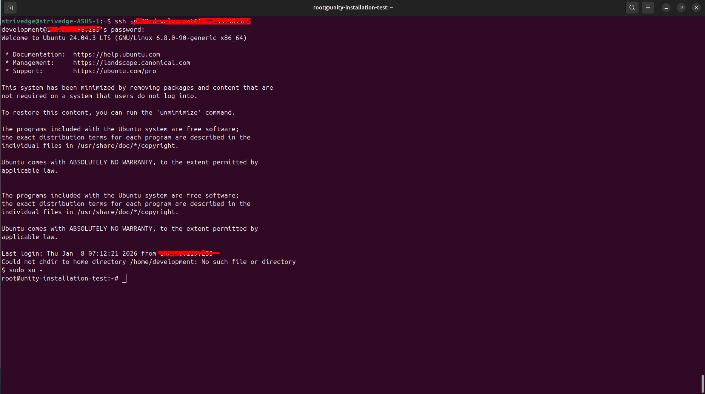
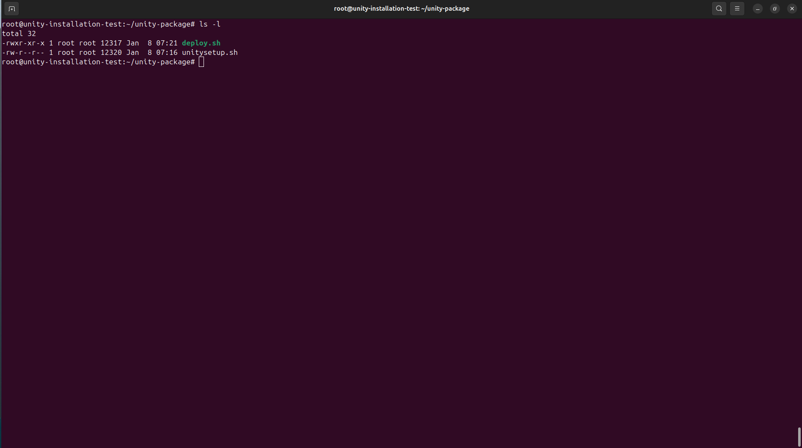
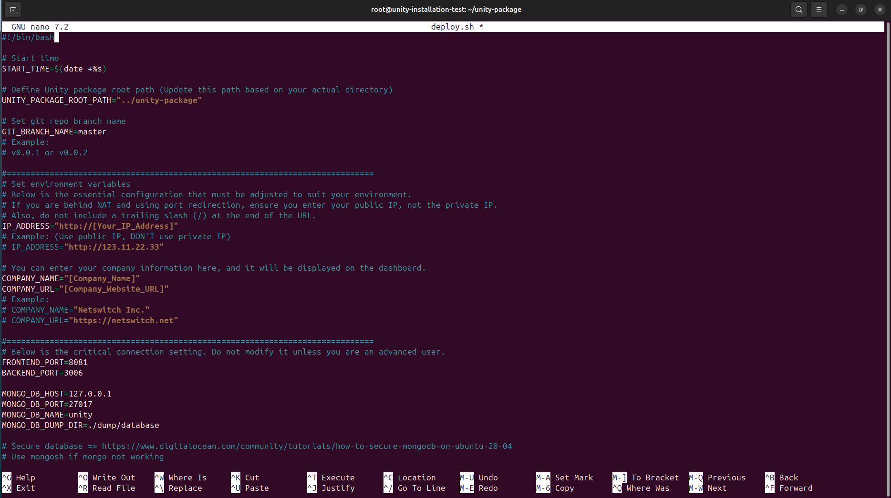
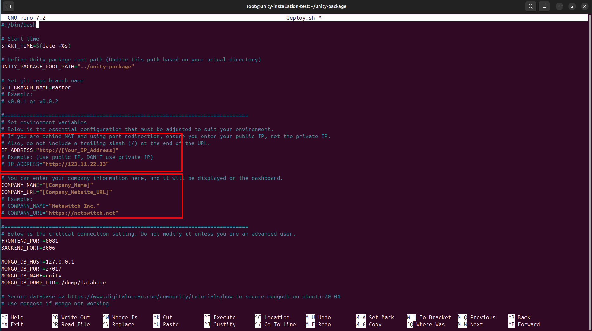
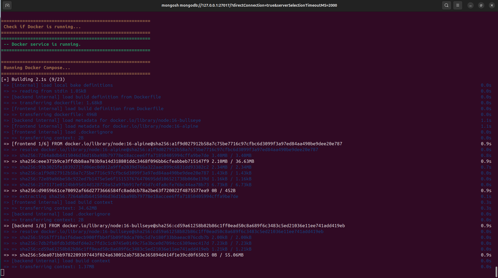
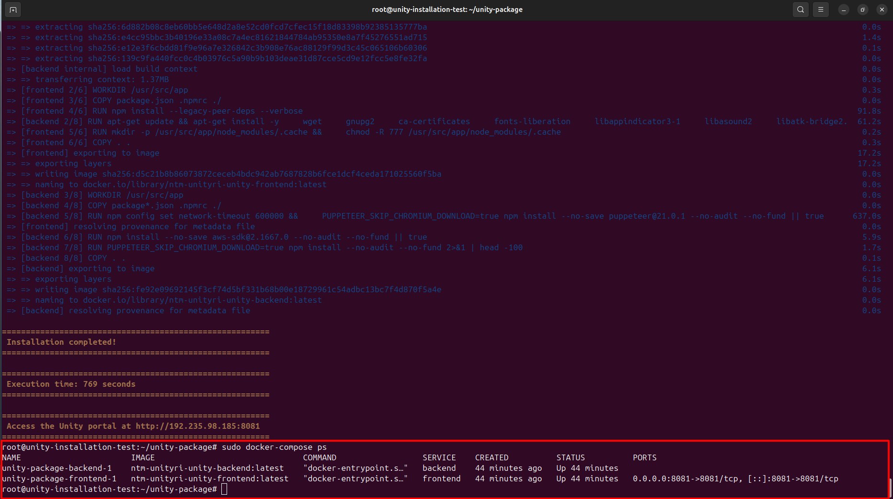
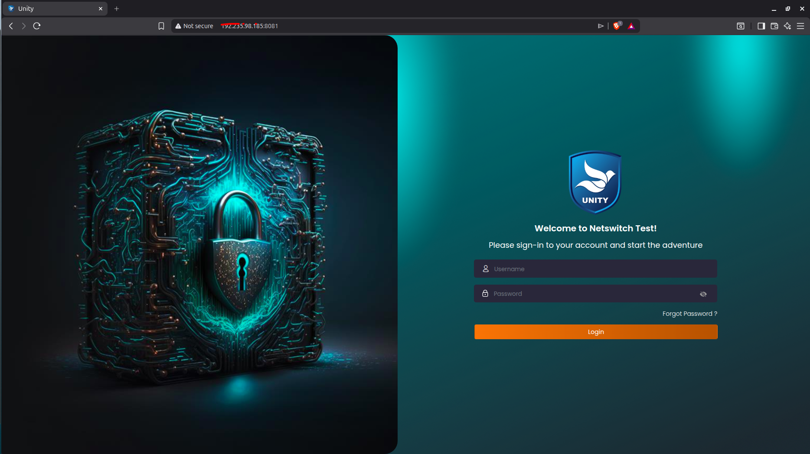

# Automated Script Deployment Guide

**Deployment Method:** Using unitysetup.sh automated script
**Status:** ✅ RECOMMENDED for fresh installations
**Estimated Time:** 10-15 minutes
**Difficulty:** ⭐ Easy

---

## 📋 Table of Contents

1. [Overview](#overview)
2. [Prerequisites](#prerequisites)
3. [Before You Start](#before-you-start)
4. [Step 1: Prepare the Script](#step-1-prepare-the-script)
5. [Step 2: Configure Settings](#step-2-configure-settings)
6. [Step 3: Run the Script](#step-3-run-the-script)
7. [Step 4: Verify Deployment](#step-4-verify-deployment)
8. [Step 5: Configure Firewall](#step-5-configure-firewall)
9. [What the Script Does](#what-the-script-does)
10. [Troubleshooting](#troubleshooting)
11. [Script Configuration Reference](#script-configuration-reference)

---

## Overview

The `unitysetup.sh` script **automates the entire deployment process**. It handles:
- ✅ Installing required software (Git, Docker, NGINX)
- ✅ Fetching latest code from repository
- ✅ Configuring environment variables
- ✅ Setting up database
- ✅ Building and starting Docker containers

**Perfect for:**
- Fresh server installations
- Automated deployments
- Quick setup process

---

## Prerequisites

### Server Requirements:
- ✅ **Ubuntu 20.04 or later** (or Debian-based Linux)
- ✅ **Minimum:** 4GB RAM, 2 CPU cores
- ✅ **Recommended:** 8GB RAM, 4 CPU cores
- ✅ **Disk Space:** 20GB+ free
- ✅ **Root/sudo access**
- ✅ **Internet connection**

### Network Requirements:
- ✅ Ports 3006 and 8081 available
- ✅ Outbound internet access (to download packages)
- ✅ Access to GitHub repository

### Check Your Server:
```bash
# Check Ubuntu version
lsb_release -a
# Should show: Ubuntu 20.04 or higher

# Check available memory
free -h
# Should show: 4GB+ available

# Check disk space
df -h /
# Should show: 20GB+ available

# Check internet connectivity
ping -c 3 google.com
# Should show: packets transmitted and received
```

---

## Before You Start

### ⚠️ CRITICAL: Understanding the Script Workflow

**The script does this automatically:**
```
1. Fetches latest code from Git → This OVERWRITES unitysetup.sh
2. Configures environment
3. Builds and deploys
```

**Important:**
- ❌ **NEVER edit `unitysetup.sh` directly** - Git will overwrite it!
- ✅ **ALWAYS copy it first** - Work with the copy (`deploy.sh`)
- ✅ **Run the copy** - Your configuration stays safe

### Important Information to Prepare:

1. **Your Server IP Address**
   ```bash
   # Find your server's public IP
   curl ifconfig.me
   # Example output: 123.45.67.89
   ```

2. **Company Information** (Optional)
   - Company name (shown in application)
   - Company website URL

---

## Step 1: Prepare the Script

### 1.1 Connect to Your Server
```bash
# SSH to your server
ssh username@your-server-ip

# Example:
# ssh admin@123.45.67.89
```

> 📸 **Screenshot Placeholder:** *SSH terminal connection showing successful login to server*
> 

### 1.2 Download and Copy the Script

**⚠️ IMPORTANT:** Don't edit the original `unitysetup.sh` file directly!

**Why?** The script pulls latest code from Git, which will **overwrite your configuration**. Always work with a copy.

```bash
# Create project directory
mkdir -p ~/projects/unity-package
cd ~/projects/unity-package

# Option 1: If script is already on server
# Copy it to a new file
cp unitysetup.sh deploy.sh

# Option 2: Upload from local machine
# scp unitysetup.sh username@your-server-ip:~/projects/unity-package/
# Then copy it:
# cp unitysetup.sh deploy.sh

# Option 3: Download from repository first
# wget https://raw.githubusercontent.com/unityri/unity/master/unitysetup.sh
# cp unitysetup.sh deploy.sh
```

**✅ Always use the copied file (`deploy.sh`) for configuration and execution!**

### 1.3 Make Script Executable
```bash
# Make the COPIED script executable
chmod +x deploy.sh

# Verify it's executable
ls -la deploy.sh
# Should show: -rwxr-xr-x (executable permissions)
```

**📝 File Structure:**
```
~/projects/unity-package/
├── unitysetup.sh    ← Original (will be overwritten by git pull)
└── deploy.sh        ← Your configured copy (safe from git pull)
```

> 📸 **Screenshot Placeholder:** *Terminal showing `ls -la` with both files visible*
> 

---

## Step 2: Configure Settings

### 2.1 Edit the COPIED Script

**⚠️ CRITICAL:** Edit `deploy.sh` (your copy), NOT `unitysetup.sh`!

```bash
# Open YOUR COPY in text editor
nano deploy.sh

# Or use vim
# vim deploy.sh
```

**❌ DON'T DO THIS:**
```bash
nano unitysetup.sh  # Wrong! Your changes will be lost!
```

**✅ DO THIS:**
```bash
nano deploy.sh      # Correct! Your changes are safe!
```

> 📸 **Screenshot Placeholder:** *Nano editor opened with deploy.sh file showing configuration variables*
> 

### 2.2 Update Required Settings

**Find and update these lines in the script:**

#### A. Set Your Server IP Address (Line 19)
```bash
# Change this line:
IP_ADDRESS="http://your-server-ip"

# To your actual public IP:
IP_ADDRESS="http://123.45.67.89"
```

**⚠️ Important:**
- Use **public IP** (not private IP like 192.168.x.x)
- Include `http://` prefix
- **No trailing slash** at the end

> 📸 **Screenshot Placeholder:** *Nano editor with IP_ADDRESS line highlighted showing where to enter your IP*
> 

#### B. Set Company Information (Lines 24-25) - Optional
```bash
# Update these lines:
COMPANY_NAME="Your Company Name"
COMPANY_URL="https://yourcompany.com"

# Example:
COMPANY_NAME="Acme Corporation"
COMPANY_URL="https://acme.com"
```

#### C. MongoDB Configuration (Lines 42-45)
```bash
MONGO_DB_SECURED=false  # Keep as false
MONGO_DB_USER=""
MONGO_DB_PASSWORD=""
MONGO_DB_AUTH=""
```

#### D. Git Repository (Line 98) - Optional
```bash
# If using different repository, update:
git remote add origin https://github.com/unityri/unity
```

### 2.3 Save and Exit
```bash
# In nano:
# Press Ctrl+X, then Y, then Enter

# In vim:
# Press Esc, then type :wq and press Enter
```

---

## Step 3: Run the Script

### 3.1 Start the Deployment

**⚠️ Run YOUR COPY (`deploy.sh`), not the original!**

```bash
# Run YOUR CONFIGURED COPY with sudo
sudo bash deploy.sh

# Or if already made executable
sudo ./deploy.sh
```

**❌ DON'T RUN THIS:**
```bash
sudo ./unitysetup.sh  # Wrong! This has default config!
```

**✅ RUN THIS:**
```bash
sudo ./deploy.sh      # Correct! This has your config!
```

### 3.2 Monitor Progress

You'll see colored output showing progress:

```
========================================================
 Checking if Git is installed...
========================================================
✅ Git is already installed.

========================================================
 Fetching the latest repository changes
========================================================
✅ Repository updated successfully.

========================================================
 Running docker-compose up --build -d
========================================================
Building frontend...
Building backend...
✅ Docker containers started successfully.

========================================================
 Installation completed!
 Execution time: 423 seconds
 Access the Unity portal at http://123.45.67.89:8081
========================================================
```

> 📸 **Screenshot Placeholder:** *Terminal showing colored deployment progress with success messages*
> 

### 3.3 Expected Duration

| Phase | Time | What's Happening |
|-------|------|------------------|
| Git setup | 10-30 sec | Installing Git, fetching code |
| Permissions | 5-10 sec | Setting directory permissions |
| Environment setup | 5-10 sec | Creating .env files |
| MongoDB import | 10-30 sec | Importing database |
| Docker install | 1-2 min | Installing Docker (if needed) |
| **Docker build** | **5-8 min** | Building application images |
| Container start | 10-20 sec | Starting containers |
| **Total** | **7-12 min** | Complete deployment |

---

## Step 4: Verify Deployment

### 4.1 Check Docker Containers
```bash
# View running containers
sudo docker-compose ps

# Expected output:
NAME                       STATUS         PORTS
unity-package-backend-1    Up 2 minutes
unity-package-frontend-1   Up 2 minutes   0.0.0.0:8081->8081/tcp
```

> 📸 **Screenshot Placeholder:** *Terminal showing docker-compose ps output with both containers "Up"*
> 

**✅ Both containers should show "Up"**

### 4.2 Check Application Logs
```bash
# View all logs
sudo docker-compose logs

# View only backend logs
sudo docker-compose logs backend

# View only frontend logs
sudo docker-compose logs frontend

# Follow logs in real-time
sudo docker-compose logs -f
```

**Look for:**
```
backend-1   | Server is running on port 3006
frontend-1  | webpack compiled successfully
```

### 4.3 Test Backend API
```bash
# Test from server
curl http://localhost:3006

# Should return JSON or HTML response (not connection refused)
```

### 4.4 Test Frontend
```bash
# Test from server
curl http://localhost:8081

# Should return HTML content
```

### 4.5 Test from Browser

**Open in your web browser:**
- **Frontend:** `http://your-server-ip:8081`
- **Backend API:** `http://your-server-ip:3006`

**Replace `your-server-ip` with your actual IP:**
- Example: `http://123.45.67.89:8081`

**✅ You should see:**
- Frontend: Login page or dashboard
- Backend: API response or welcome message

> 📸 **Screenshot Placeholder:** *Web browser showing Unity application login page at http://your-server-ip:8081*
> 

---

## Step 5: Configure Firewall

### 5.1 Open Required Ports

**If using UFW (Ubuntu Firewall):**
```bash
# Enable firewall
sudo ufw enable

# Allow SSH (IMPORTANT - do this first!)
sudo ufw allow 22/tcp

# Allow backend API port
sudo ufw allow 3006/tcp comment 'Unity Backend API'

# Allow frontend port
sudo ufw allow 8081/tcp comment 'Unity Frontend'

# Allow NGINX (optional)
sudo ufw allow 80/tcp
sudo ufw allow 443/tcp

# Reload firewall
sudo ufw reload

# Check status
sudo ufw status
```

**Expected output:**
```
Status: active

To                         Action      From
--                         ------      ----
22/tcp                     ALLOW       Anywhere
3006/tcp                   ALLOW       Anywhere    # Unity Backend API
8081/tcp                   ALLOW       Anywhere    # Unity Frontend
```

### 5.2 Cloud Provider Firewall

**If using cloud provider (AWS, Azure, GCP, etc.):**

1. Log in to cloud provider dashboard
2. Navigate to: VM → Networking → Firewall Rules
3. Add inbound rules:

**Rule 1: Backend API**
```
Port: 3006
Protocol: TCP
Source: 0.0.0.0/0 (or specific IPs)
Action: Allow
```

**Rule 2: Frontend**
```
Port: 8081
Protocol: TCP
Source: 0.0.0.0/0 (or specific IPs)
Action: Allow
```

### 5.3 Verify Port Access

```bash
# Check ports are listening
sudo netstat -tlnp | grep -E "3006|8081"

# Expected output:
tcp   0   0 0.0.0.0:3006   0.0.0.0:*   LISTEN   1234/node
tcp   0   0 0.0.0.0:8081   0.0.0.0:*   LISTEN   1235/node
```

---

## What the Script Does

### Phase 1: Prerequisites Installation
```bash
✅ Checks if Git is installed (installs if missing)
✅ Initializes Git repository
✅ Adds remote repository
✅ Configures safe directory
```

### Phase 2: Code Synchronization
```bash
✅ Fetches latest code from GitHub
✅ Checks out master branch
✅ Resets to latest version
✅ Sets directory permissions (0777)
```

### Phase 3: Environment Configuration
```bash
✅ Creates .env files (root, backend, frontend)
✅ Sets frontend port (8081)
✅ Sets backend port (3006)
✅ Configures MongoDB connection
✅ Sets company information
✅ Configures API URLs
```

### Phase 4: Database Setup
```bash
✅ Imports MongoDB data (if mongoImport.sh exists)
✅ Creates database structure
✅ Populates initial data
```

### Phase 5: Software Installation
```bash
✅ Installs NGINX (if not present)
✅ Enables NGINX service
✅ Installs Docker (if not present)
✅ Installs Docker Compose
✅ Enables Docker service
```

### Phase 6: Application Deployment
```bash
✅ Stops existing containers
✅ Builds Docker images
✅ Starts containers in detached mode
✅ Verifies deployment
```

### Phase 7: Completion
```bash
✅ Shows execution time
✅ Displays access URL
✅ Prints success message
```

---

## Troubleshooting

### Issue 1: Script Fails During Git Fetch

**Error:**
```
Failed to fetch from remote repository
```

**Solution:**
```bash
# Check internet connectivity
ping -c 3 github.com

# Verify Git repository URL
git remote -v

# Update repository URL if needed
git remote set-url origin https://github.com/unityri/unity

# Try manual fetch
git fetch origin master
```

### Issue 2: Permission Denied

**Error:**
```
Permission denied
```

**Solution:**
```bash
# Run YOUR COPY with sudo
sudo bash deploy.sh

# Or make executable and run
chmod +x deploy.sh
sudo ./deploy.sh
```

### Issue 7: My Configuration Was Overwritten!

**Problem:**
```
I edited unitysetup.sh but my changes disappeared after running the script!
```

**Why this happens:**
The script runs `git pull` which overwrites `unitysetup.sh` with the version from GitHub.

**Solution:**
```bash
# 1. Always work with a COPY
cp unitysetup.sh deploy.sh

# 2. Edit the COPY
nano deploy.sh

# 3. Run the COPY
sudo ./deploy.sh

# The original unitysetup.sh will be overwritten by git,
# but your deploy.sh will remain unchanged!
```

### Issue 3: Docker Compose Build Fails

**Error:**
```
Docker compose failed
```

**Solution:**
```bash
# Check Docker is running
sudo systemctl status docker

# Start Docker if stopped
sudo systemctl start docker

# Check Docker Compose version
docker-compose --version

# View detailed build logs
sudo docker-compose build --no-cache --progress=plain

# If build hangs, see LOCAL_BUILD_DEPLOYMENT.md
# for building locally and transferring images
```

### Issue 4: MongoDB Connection Failed

**Error:**
```
MongoError: connect ECONNREFUSED
```

**Solution:**
```bash
# Check MongoDB is running
sudo systemctl status mongod

# Start MongoDB if stopped
sudo systemctl start mongod

# Enable MongoDB to start on boot
sudo systemctl enable mongod

# Verify MongoDB is listening
sudo netstat -tlnp | grep 27017

# Test MongoDB connection
mongo --eval "db.version()"
# or
mongosh --eval "db.version()"
```

### Issue 5: Containers Not Accessible

**Error:**
```
Connection refused when accessing http://your-server-ip:8081
```

**Solution:**
```bash
# 1. Check containers are running
sudo docker-compose ps

# 2. Check firewall
sudo ufw status | grep -E "3006|8081"

# 3. Open ports if needed
sudo ufw allow 3006/tcp
sudo ufw allow 8081/tcp

# 4. Check cloud provider firewall rules

# 5. Verify IP address is correct
curl ifconfig.me

# 6. Restart containers
sudo docker-compose restart
```

### Issue 6: Frontend Shows 502 Error

**Error:**
```
502 Bad Gateway
```

**Solution:**
```bash
# Check backend is running
sudo docker-compose logs backend

# Verify backend port
sudo netstat -tlnp | grep 3006

# Check frontend .env has correct backend URL
cat frontend/.env | grep BACKEND

# Should show:
# REACT_APP_BACKEND_REST_API_URL=http://your-server-ip:3006

# Restart frontend
sudo docker-compose restart frontend
```

---

## Script Configuration Reference

### Essential Settings (MUST Configure)

| Setting | Line | Default | Description |
|---------|------|---------|-------------|
| **IP_ADDRESS** | 19 | `http://your-server-ip` | Your server's public IP |
| **COMPANY_NAME** | 24 | `"Unity Ri Test"` | Your company name |
| **COMPANY_URL** | 25 | `"https://netswitch.net"` | Your company website |

### Port Configuration (Usually Don't Change)

| Setting | Line | Default | Description |
|---------|------|---------|-------------|
| **FRONTEND_PORT** | 32 | `8081` | Frontend web application port |
| **BACKEND_PORT** | 33 | `3006` | Backend API port |

### MongoDB Configuration

| Setting | Line | Default | Description |
|---------|------|---------|-------------|
| **MONGO_DB_HOST** | 35 | `127.0.0.1` | MongoDB host (localhost) |
| **MONGO_DB_PORT** | 36 | `27017` | MongoDB port |
| **MONGO_DB_NAME** | 37 | `unity` | Database name |
| **MONGO_DB_SECURED** | 42 | `false` | Enable if MongoDB is secured |
| **MONGO_DB_USER** | 43 | `""` | MongoDB username (if secured) |
| **MONGO_DB_PASSWORD** | 44 | `""` | MongoDB password (if secured) |
| **MONGO_DB_AUTH** | 45 | `""` | Auth database (usually "admin") |

### Advanced Settings

| Setting | Line | Default | Description |
|---------|------|---------|-------------|
| **GIT_BRANCH_NAME** | 10 | `master` | Git branch to deploy |
| **IS_EMPTY_BLANK_DATA_DISPLAY** | 48 | `"false"` | Show blank data in UI |

---

## Post-Deployment Steps

### 1. Secure Your Installation

```bash
# Change default passwords
# Update backend/.env with secure passwords

# Enable firewall
sudo ufw enable

# Only allow specific IPs (optional)
sudo ufw delete allow 3006/tcp
sudo ufw delete allow 8081/tcp
sudo ufw allow from YOUR_OFFICE_IP to any port 3006
sudo ufw allow from YOUR_OFFICE_IP to any port 8081
```

### 2. Set Up SSL/HTTPS (Recommended)

```bash
# Install Certbot
sudo apt install certbot python3-certbot-nginx

# Obtain SSL certificate (requires domain name)
sudo certbot --nginx -d yourdomain.com

# Auto-renew certificate
sudo certbot renew --dry-run
```

### 3. Configure Backups

```bash
# Create backup directory
mkdir -p ~/backups

# Backup database
mongodump --out ~/backups/mongodb-$(date +%Y%m%d)

# Backup application files
tar -czf ~/backups/unity-package-$(date +%Y%m%d).tar.gz \
  --exclude='node_modules' \
  --exclude='.git' \
  ~/projects/unity-package/
```

### 4. Set Up Monitoring

```bash
# Check application status
sudo docker-compose ps

# View resource usage
sudo docker stats

# Set up log rotation
sudo nano /etc/docker/daemon.json
# Add:
# {
#   "log-driver": "json-file",
#   "log-opts": {
#     "max-size": "10m",
#     "max-file": "3"
#   }
# }
```

---

## Updating the Application

### Method 1: Rerun YOUR Configured Script
```bash
# Navigate to project directory
cd ~/projects/unity-package

# Rerun YOUR COPY (not the original!)
sudo ./deploy.sh

# Script will:
# - Fetch latest code from GitHub
# - Rebuild containers with YOUR configuration
# - Restart application
```

**⚠️ Important:** Your `deploy.sh` keeps your configuration even after git pull updates the repository!

### Method 2: Manual Update
```bash
# Pull latest code
git pull origin master

# Rebuild and restart
sudo docker-compose down
sudo docker-compose up --build -d
```

---

## Rollback Procedure

**If deployment fails, rollback to previous version:**

```bash
# Stop current deployment
sudo docker-compose down

# Rollback Git to previous commit
git log --oneline -5  # View recent commits
git reset --hard COMMIT_HASH  # Use previous commit hash

# Rebuild with previous version
sudo docker-compose up --build -d
```

---

## Comparison with Other Methods

| Aspect | Script Deployment | Local Build | Server Build |
|--------|------------------|-------------|--------------|
| **Setup Time** | ⭐⭐⭐ 10-15 min | 15-20 min | 30-60 min |
| **Automation** | ✅ Fully automated | ❌ Manual steps | ❌ Manual steps |
| **Prerequisites** | ✅ Auto-installs | Requires local Docker | Requires good network |
| **Best For** | Fresh installations | Regular deployments | No local machine |
| **Difficulty** | ⭐ Easy | ⭐ Easy | ⭐⭐ Medium |

---

## Summary

**This script is perfect for:**
- ✅ **Fresh server installations**
- ✅ **Automated deployments**
- ✅ **Quick setup** (10-15 minutes)
- ✅ **Minimal manual configuration**

**Key Benefits:**
- 🚀 Fully automated process
- 📦 Installs all dependencies
- ⚙️ Configures everything automatically
- 🔄 Easy to update (just rerun script)
- ✅ Consistent deployments

**Important:**
- ⚠️ **ALWAYS copy `unitysetup.sh` to `deploy.sh` before editing**
- ⚠️ **NEVER edit `unitysetup.sh` directly** (git will overwrite it!)
- ⚠️ **ALWAYS run `deploy.sh`** (your configured copy)
- Must have root/sudo access
- Requires internet connection
- Make sure to configure IP_ADDRESS before running
- Test in staging environment first

---

**Last Updated:** 2026-01-06
**Status:** ✅ Recommended for Automated Deployment
**Script Version:** Based on unitysetup.sh
**Estimated Time:** 10-15 minutes
